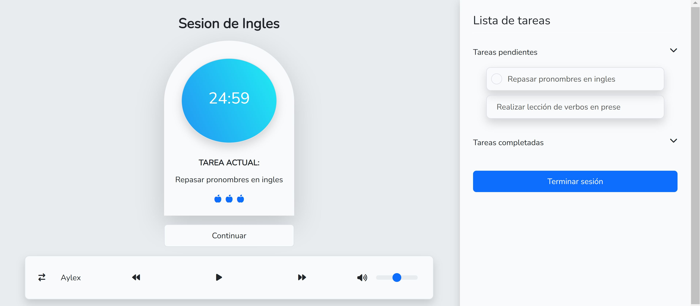
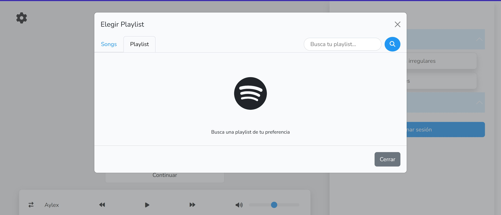

# **FAST POMODORO**
Plataforma web orientada a la tecnica de estudio Pomodoro con la capacidad para crear sesiones de estudios basadonse en tareas.
Esta Plataforma busca optimizar los tiempos de estudio dedicados por los estudiantes, profesionales y cualquiera que busque mejorar su productividad.

ENLACE A PLATAFORMA: 
<a href="https://fastpomodoro-production.up.railway.app/">
    <strong> FastPomodoro</strong>
</a>

## CARACTERISTICAS
Integracion con otras herramientas como Google OAUTH para la autenticacion de usuarios o Spotify para brindar una mayor experiencia a los usuarios al realizar sus sesiones de estudio
### GOOGLE OAUTH

### SPOTIFY

PLATAFORMA CONSTRUIDA CON TECNOLOGIAS COMO:  

1. Laravel
2. React (Vite)
3. react-router-dom
4. Bootstrap

     
    
    
 

Librerias como infinite-scroll: <a href="https://github.com/ankeetmaini/react-infinite-scroll-component" target="_blank">Ir a sitio</a>

